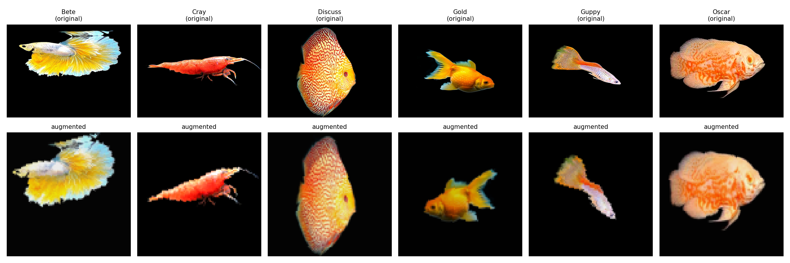
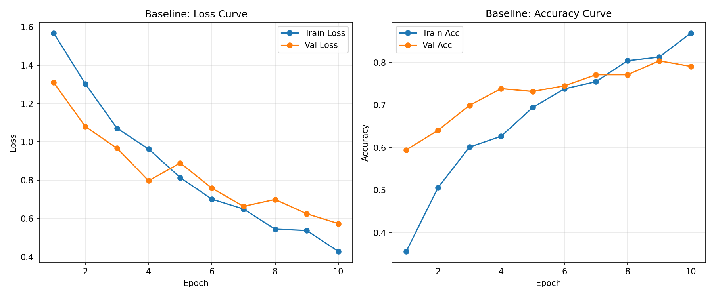
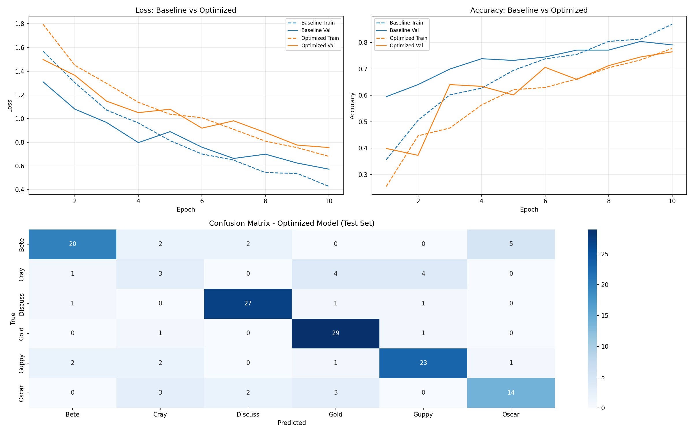

# Homework Three: Deep Learning for Fish Classification

**CS 898BA – Image Analysis and Computer Vision**
**Branch:** `Feature-Classification`

## Overview
A custom CNN (built from scratch in PyTorch) classifies images of 6 fish/aquatic species: **Bete, Cray, Discuss, Gold, Guppy, Oscar**. A baseline model is trained with standard hyperparameters, then a hyperparameter search is used to train an optimized model, and both are compared on a held-out test set.

## Dataset
- 1,016 images across 6 classes (Bete: 194, Cray: 80, Discuss: 201, Gold: 207, Guppy: 189, Oscar: 145)
- Source images are 800x600 JPG/PNG
- Notable class imbalance: `Cray` has less than half the samples of the largest class (`Gold`) — addressed via class-weighted loss during optimization (see Part 4)

## Repository Structure
```
src/
  data_pipeline.py        # Part 2: stratified split, resize/normalize, augmentation
  visualize_augmentation.py
  model.py                 # Part 3: FishCNN architecture
  train_baseline.py        # Part 3: baseline training loop
  hparam_search.py         # Part 4: random search over LR / batch size / dropout / weight decay
  train_optimized.py       # Part 4: final optimized model training
  evaluate.py              # Part 5: test-set evaluation, classification reports, confusion matrix
outputs/
  models/                  # saved .pt weights (baseline, optimized, and all search trials)
  plots/                   # all figures referenced below
  reports/                 # JSON: split info, training histories, search results, classification reports
AI_Log.md
README.md
```

---

## Part 2: Data Preprocessing & Augmentation
- Stratified 70/15/15 train/val/test split (proportional per class — verified in `outputs/reports/split_info.json`)
- All images resized to **96x96** and normalized to **[-1, 1]**
- Training-set-only augmentation: random horizontal flip, ±15° rotation, brightness/contrast jitter

**96x96 was chosen over the larger suggested options (128x128 / 224x224) because this pipeline was developed and run on a single-core CPU environment; 96x96 kept full end-to-end runs (data loading → training → evaluation) practical while still preserving enough detail for the CNN to distinguish species (fin shape, color pattern, body silhouette).**



---

## Part 3: Baseline CNN
Architecture (`src/model.py`):
- Conv Block 1: Conv2d(3→32, 3x3) → ReLU → MaxPool
- Conv Block 2: Conv2d(32→64, 3x3) → ReLU → MaxPool
- Conv Block 3: Conv2d(64→128, 3x3) → ReLU → MaxPool
- Flatten → Dense(256) → ReLU → Dropout(0.5) → Dense(6) [softmax via CrossEntropyLoss]
- ~4.8M trainable parameters

Training config: Adam, lr=0.001, batch size=32, 10 epochs, unweighted CrossEntropyLoss.

**Final baseline metrics:** Train Acc 86.9% | Val Acc 79.1%



---

## Part 4: Hyperparameter Optimization
**Strategy:** Random search over the full grid (3 learning rates × 2 batch sizes × 2 dropout rates × 2 weight decay values = 24 combinations), sampling 6 configurations, each trained for 6 epochs.

| Hyperparameter | Values tested |
|---|---|
| Learning rate | 0.01, 0.001, 0.0001 |
| Batch size | 32, 64 |
| Dropout | 0.3, 0.5 |
| Weight decay (L2) | 0.0, 1e-4 |

Class-weighted `CrossEntropyLoss` was used during search and for the optimized model's final training run, to counteract the `Cray` class's underrepresentation.

**Search results (ranked by best validation loss):**

| Rank | LR | Batch | Dropout | Weight Decay | Val Loss | Val Acc |
|---|---|---|---|---|---|---|
| 1 | 0.001 | 64 | 0.3 | 1e-4 | 0.9195 | 0.706 |
| 2 | 0.001 | 32 | 0.5 | 0.0 | 0.9532 | 0.667 |
| 3 | 0.001 | 64 | 0.5 | 1e-4 | 1.0103 | 0.654 |
| 4 | 0.01 | 64 | 0.3 | 1e-4 | 1.0874 | 0.536 |
| 5 | 0.0001 | 32 | 0.5 | 0.0 | 1.1353 | 0.556 |
| 6 | 0.0001 | 64 | 0.5 | 1e-4 | 1.2591 | 0.556 |

**Best config:** `lr=0.001, batch_size=64, dropout=0.3, weight_decay=1e-4` — retrained for the full 10 epochs (matching the baseline) as the final "optimized" model.

---

## Part 5: Evaluation and Analysis

### Quantitative Comparison (Test Set)

**Baseline — Overall Accuracy: 79.1%**

| Class | Precision | Recall | F1-Score |
|---|---|---|---|
| Bete | 0.74 | 0.86 | 0.79 |
| Cray | 0.38 | 0.25 | 0.30 |
| Discuss | 0.93 | 0.87 | 0.90 |
| Gold | 0.84 | 0.84 | 0.84 |
| Guppy | 0.84 | 0.90 | 0.87 |
| Oscar | 0.71 | 0.68 | 0.70 |
| **Macro avg** | **0.74** | **0.73** | **0.73** |

**Optimized — Overall Accuracy: 75.8%**

| Class | Precision | Recall | F1-Score |
|---|---|---|---|
| Bete | 0.83 | 0.69 | 0.75 |
| Cray | 0.27 | 0.25 | 0.26 |
| Discuss | 0.87 | 0.90 | 0.89 |
| Gold | 0.76 | 0.94 | 0.84 |
| Guppy | 0.79 | 0.79 | 0.79 |
| Oscar | 0.70 | 0.64 | 0.67 |
| **Macro avg** | **0.71** | **0.70** | **0.70** |

### Qualitative Analysis

**Effect of augmentation on training stability.** The augmented training curves (Part 3 plot) show a smooth, mostly monotonic decrease in both training and validation loss, with the val loss tracking the train loss closely rather than diverging early — a sign that flips/rotation/brightness jitter were mild enough to preserve class-discriminating features (fin shape, coloration) while still reducing memorization of exact pixel patterns. There is a brief validation loss uptick around epoch 5 in the baseline run, consistent with normal stochastic noise rather than a stability problem, since it recovers immediately afterward.

**Effect of hyperparameter changes.** Contrary to the usual expectation that tuning improves results, the optimized model (76% test accuracy) performed *slightly below* the baseline (79%) under this experiment's constraints. Looking at the search results table, the clearest signal is on **learning rate**: 0.01 was too large (worst results, unstable convergence) and 0.0001 was too small (models hadn't converged within the 6-epoch search budget), while 0.001 — the same rate used in the baseline — was consistently best. In other words, the search *confirmed* the baseline's learning rate was already a good choice rather than finding a better one.

The added regularization (dropout reduced from 0.5→0.3, plus new weight decay of 1e-4) combined with class-weighted loss meant the optimized model was optimizing a harder, more conservative objective within the same 10-epoch budget as the baseline — its train accuracy (77.8%) was noticeably lower than the baseline's (86.9%), consistent with regularization doing its job of restricting overfitting, but the model simply needed more epochs to fully exploit that regularization and catch up in generalization. This is a common tradeoff in hyperparameter tuning: parameters chosen via a **short** search budget (6 epochs/trial here, due to CPU constraints) may not reflect performance at the **longer** training budget used for the final model. A fairer comparison would extend both the search and final training runs to more epochs (e.g., 30–50) — recommended as a follow-up if you have GPU access.

**Class-level patterns.** `Cray` was the weakest class for both models (F1 = 0.30 baseline, 0.26 optimized) — expected, since it has the fewest images (80 total, only 12 in the test set) despite class weighting in the optimized model's loss function. `Discuss` and `Gold` were the strongest performers in both models, likely due to their more distinctive coloration/body shape and larger sample sizes.

### Visualizations



The confusion matrix (bottom panel) shows most of the optimized model's confusion involves `Cray`, `Oscar`, and `Bete` — species with more visually similar body silhouettes and less saturated coloration compared to `Discuss` or `Gold`.

---

## How to Reproduce
```bash
pip install torch torchvision scikit-learn matplotlib seaborn pillow

python -m src.data_pipeline          # verify data pipeline + splits
python -m src.visualize_augmentation # generate augmentation example figure
python -m src.train_baseline         # train & save baseline model
python -m src.hparam_search          # run hyperparameter random search
python -m src.train_optimized        # train & save optimized model using best config
python -m src.evaluate               # generate test reports + comparison figure
```

## Notes on Compute
This pipeline was developed and run on a single-core CPU environment. Image size (96x96), search budget (6 trials x 6 epochs), and final training length (10 epochs) were chosen to keep full runs practical in that setting. All scripts are unmodified standard PyTorch and will run as-is, faster, on a GPU machine — increasing `IMG_SIZE`, `EPOCHS`, and `N_TRIALS` is recommended if you have GPU access for a stronger final result.

---

## Part 6: Submission
GitHub repository link submitted via Blackboard, with the `Feature-Classification` branch containing all Homework Three additions.
