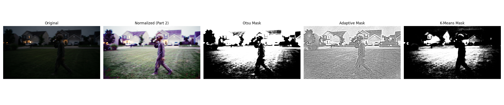

# CS898BA Project 1 — Image Analysis and Processing with OpenCV

## Student Information

Name: Aditya Ashokbhai Gaikwad

## Objective

The goal of this project was to perform image analysis and processing
using OpenCV: computing image statistics, converting between color
spaces, applying histogram equalization, generating affine
transformations, applying Gaussian blur at multiple scales, and
comparing four edge-detection algorithms.

## Technologies Used

- Python 3.12
- OpenCV (opencv-python-headless)
- NumPy
- SciPy
- Matplotlib

## Project Structure

```
.
├── hello.py                     # sanity-check script
├── read.md                      # this file
├── requirements.txt
├── result/
│   └── statistics.txt           # per-channel pixel statistics (Part 2)
├── images/
│   ├── original/                # source image
│   ├── converted/                # grayscale, binary, HSV, LAB, HLS, histogram-equalized
│   ├── transformed/               # 14 affine transformations
│   ├── blurred/                  # Gaussian blur, 7 sigma values (gitignored, regenerated by script)
│   ├── subsets/                   # 4 random subsets of 42 images each (gitignored, regenerated by script)
│   ├── subset_used/                # the 42 "before" images from the chosen subset (subset_1)
│   ├── edge_results/              # 168 "after" images: Sobel/Laplacian/Canny/Prewitt outputs for subset_1
│   ├── plots/                     # one Original+4-detector comparison figure per image in subset_1
│   └── sample_results/            # 6 comparison figures selected for this write-up
└── src/
    ├── main.py                   # runs the full pipeline end to end
    ├── image_statistics.py       # Part 2: per-channel statistics
    ├── color_conversion.py       # color space conversions + histogram equalization
    ├── affine_transform.py       # rotation / translation / scaling / shearing
    ├── gaussian_blur.py          # Gaussian blur, sigma = 0.5 ... 3.5
    ├── create_subsets.py         # builds 4 random subsets from all generated images
    ├── edge_detection.py         # Part 3: Sobel / Laplacian / Canny / Prewitt
    └── plot_generator.py         # builds the comparison figures in images/plots
```

`images/blurred` and `images/subsets` are listed in `.gitignore`
because together they hold thousands of intermediate files that are
fully reproducible from the committed source images (`images/subsets`
duplicates images already present elsewhere; only the chosen
`subset_1` is kept, as `images/subset_used/`). `images/edge_results`
(the 168 "after" images) and `images/subset_used` (the 42 "before"
images) are committed, since Part 3 explicitly requires saving both.

## Setup and Execution

1. Install dependencies:
   ```
   pip install -r requirements.txt
   ```
2. Run the full pipeline from the project root (so relative paths like
   `images/...` resolve correctly):
   ```
   python src/main.py
   ```
   This regenerates every stage in order: image statistics, color
   conversions, affine transforms, Gaussian blur, subset creation,
   edge detection, and comparison plots.
3. Individual stages can also be run on their own, e.g.
   `python src/edge_detection.py`, as long as the previous stage's
   output already exists in `images/`.
4. Outputs land in `result/statistics.txt` and the various `images/`
   subfolders described above.

## Part 2: Image Statistics

`src/image_statistics.py` splits the source image into its Blue,
Green, and Red channels and computes the min, max, mean, median,
mode, skew, range, standard deviation, and variance of each channel.
Results are written to `result/statistics.txt`:

| Channel | Min | Max | Mean | Median | Mode | Skew | Std Dev | Variance |
|---|---|---|---|---|---|---|---|---|
| Blue  | 0 | 255 | 21.83 | 10.0 | 4  | 1.68 | 26.09 | 680.79 |
| Green | 0 | 255 | 24.64 | 16.0 | 11 | 1.77 | 22.07 | 486.91 |
| Red   | 0 | 255 | 20.61 | 12.0 | 4  | 2.12 | 22.29 | 496.999 |

All three channels have a low mean relative to the 0–255 range and a
positive skew (Red most of all), which tells us the source photo is
generally dark with a long tail of bright pixels — consistent with a
low-light photo containing a few localized bright spots (porch/window
lights). This low overall brightness turns out to matter later,
in the edge-detection analysis.

## Color Space Conversions

`src/color_conversion.py` produces five representations of the source
image, each useful for a different purpose:

- **Grayscale** — collapses color to intensity; needed as the input
  format for every edge detector used in Part 3.
- **Binary** — a fixed threshold (127) applied to the grayscale image;
  useful for isolating the brightest regions (here, the porch/window
  lights) but discards almost all other structure since the image is
  so dark.
- **HSV** — separates color (Hue), intensity (Saturation), and
  brightness (Value); used here specifically so histogram equalization
  can be applied to the Value channel alone without distorting hue/color.
- **LAB (CIELAB)** — separates lightness (L) from color (a/b);
  designed to be closer to human perception of color difference than
  RGB.
- **HLS** — similar to HSV but orders brightness between the two color
  components; included as an alternative brightness-separated space
  for the affine-transform tests below.

## Histogram Equalization

Histogram equalization was applied to the Value (V) channel of the
HSV image to normalize illumination and improve contrast, then
converted back to BGR and saved as `images/converted/equalized_rgb.png`.
Because equalization only touches the V channel, hue and saturation
(the actual colors) are preserved while the very low contrast of the
original dark photo is stretched out — this image turns out to give
the best edge-detection results in Part 3, since detectors depend on
having a wide range of gradient magnitudes to work with.

## Affine Transformations

Four affine transformation types were applied, each to a different
color-space variant of the image, for a total of 14 unique
transformations:

- Rotation (`cv2.getRotationMatrix2D` + `cv2.warpAffine`)
- Translation (custom 2×3 translation matrix)
- Scaling (`cv2.resize`)
- Shearing (custom 2×3 shear matrix)

## Gaussian Blur Analysis

Every image produced so far (original, converted, transformed — 21
images total) was blurred at 7 sigma values (0.5, 1.0, 1.5, 2.0, 2.5,
3.0, 3.5), producing 147 blurred images. As sigma increases, fine
detail and edge sharpness decrease as expected — and, as shown below,
this has a large and measurable effect on downstream edge detection.

## Part 3: Edge Detection

### Correction from the previous submission

The originally submitted `edge_detection.py` and `plot_generator.py`
each had an indentation bug: the body of the `for file in
os.listdir(...)` loop was not actually indented inside the loop, so
the processing code ran only **once**, after the loop had already
finished, using whichever file happened to be last in the directory
listing. As a result, only 1 of the 42 images in `subset_1` was ever
processed, only 1 comparison plot existed in `images/plots`, and the
one image that happened to be tested was a heavily blurred (sigma =
3.0), very dark image — on which Canny's fixed thresholds (100/200)
produced a completely blank output. The written analysis claimed
"Canny produced the most useful results," which directly contradicted
that one plot and was never checked against it.

Both scripts have been fixed (loop body correctly indented, `continue`
used to skip non-PNG files) and re-run on all 42 images in `subset_1`.
The analysis below is based on all 42 resulting comparison plots, not
one.

### Sobel

Pros: fast; detects strong directional gradients.
Cons: produces relatively thick edges; sensitive to noise.

### Laplacian

Pros: detects edges in all directions at once (second derivative).
Cons: highly noise sensitive; nearly disappears once any Gaussian
blur is applied, since blur removes the high-frequency content the
second derivative depends on.

### Canny

Pros: thin, well-localized edges with built-in noise suppression —
**when** the image has enough contrast/gradient magnitude to clear its
hysteresis thresholds.
Cons: with fixed thresholds (100/200 here), it is much more fragile
than the other three detectors on dark or blurred images; it can
silently output nothing without any error or warning.

### Prewitt

Pros: simple, fast.
Cons: slightly less accurate than Sobel due to its unweighted kernel.

## Edge Detection Comparison (across all 42 images in subset_1)

To check the "Canny performs best" claim properly, edge-pixel density
(percentage of pixels above a fixed intensity threshold) was measured
for every detector, on every one of the 42 images in `subset_1`:

| Detector | Mean edge-pixel density |
|---|---|
| Sobel | ~10% |
| Laplacian | ~2% |
| Canny | **~0.4%** |
| Prewitt | ~1.6% |

Canny produced **near-zero output on roughly 70% of the images in the
subset** — not because Canny is a weak detector in general, but
because this project used one fixed threshold pair (100, 200) across
images with very different brightness and blur levels. Splitting the
same 42 images by whether Gaussian blur was applied confirms blur is
the dominant factor:

| Group | Mean Canny edge density |
|---|---|
| No blur applied (sigma = 0) | ~2–3.6% |
| Blurred (sigma ≥ 0.5) | **~0.2%** |

Unblurred images have roughly **10–18× more** surviving Canny edge
pixels than blurred ones, because Gaussian blur directly reduces the
gradient magnitudes that Canny's hysteresis thresholds depend on. Low
intrinsic image contrast (independent of blur) has a similar effect —
see the dark, unblurred grayscale example below, where Canny still
comes back almost empty.

**Correct conclusion:** Canny is not simply "the best" or "the worst"
detector for this dataset — it is the most contrast-dependent of the
four. On brighter, higher-contrast, lightly-blurred images (e.g. the
histogram-equalized version) it produces the cleanest, thinnest, most
useful edges of any detector tested. On dark or heavily blurred
images, its fixed thresholds cause it to fail almost completely,
while Sobel and Prewitt (which are visualized as raw gradient
magnitude rather than hard-thresholded) still show something, even if
noisier. Laplacian is the least blur-tolerant of all four.

## Sample Results

Six comparison plots (Original / Sobel / Laplacian / Canny / Prewitt),
selected to show this full range of behavior, from `images/sample_results/`:

**1. Bright, high-contrast, unblurred — Canny at its best**


Canny produces the cleanest, thinnest edges of all four detectors here.

**2. The same source image, heavily blurred (sigma = 3.0) — Canny fails**


Canny's output is now almost entirely blank, while Sobel and Prewitt
still show a faint outline. This pair is the clearest illustration of
blur causing Canny's failure.

**3. Dark, low-contrast, unblurred**


Canny is already close to blank here, showing that low intrinsic
contrast alone (without any blur) is enough to break it.

**4. High local-contrast, unblurred (raw HSV channels displayed as BGR)**


Canny picks up real structure but also noise, since noise gradients
can also clear a low-enough threshold.

**5. Lightly blurred (sigma = 0.5)**


Canny is visibly weaker than in the unblurred case but not yet blank.

**6. Heavily blurred version of the same rotated image (sigma = 3.0)**


Canny is essentially blank.

## Conclusion

This project applied image statistics, color space conversion,
contrast enhancement, affine transformations, Gaussian blurring, and
four edge detectors to a single source photo and its many derived
variants. The most important finding, once the pipeline bug that
limited analysis to a single image was fixed and all 42 images in
`subset_1` were actually processed, is that **no single edge detector
is unconditionally "best"** for this dataset. Canny gives the
cleanest results on bright, high-contrast, lightly-blurred images, but
its fixed hysteresis thresholds make it the most fragile of the four
detectors under blur or low intrinsic contrast — conditions that
described roughly 70% of the images in the tested subset. A
production pipeline would need either adaptive/percentile-based Canny
thresholds or a pre-processing contrast-normalization step (such as
the histogram equalization already implemented in this project) to
make Canny reliable across a varied dataset like this one.

---

# Homework 2 — Image Segmentation

Branch: `Feature-Segmentation`. Note: the assignment refers to
"README.md" but this project's existing documentation file from
Homework 1 is `read.md` (lowercase) — Homework 2 content is appended
to that same file rather than creating a second, separate README.

## Setup and Execution

```
pip install -r requirements.txt
python src/main_segmentation.py
```

This runs, in order: color normalization (Part 2), Otsu + Adaptive
thresholding (Part 3), the manual ground truth mask, K-Means
clustering (Part 4 — depends on the ground truth mask to select K,
see below), and the final IoU/Dice evaluation + comparison plot
(Part 5). Individual scripts can also be run on their own as long as
their inputs already exist:

```
src/color_normalization.py
src/threshold_segmentation.py
src/ground_truth_mask.py
src/kmeans_segmentation.py
src/evaluate_segmentation.py
```

## Part 2: Multi-Channel Color Normalization

`src/color_normalization.py` splits the original Homework 1 image
into its raw B, G, R channels, applies histogram equalization to
**each channel independently**, and merges them back into a color
image (`images/segmentation/normalized/normalized_color.png`). This
is a stronger normalization than Homework 1's approach, which only
equalized the HSV Value channel — stretching contrast in all three
channels separately makes the previously very dark, low-contrast
scene dramatically clearer, at the cost of shifting color balance
slightly (independent per-channel equalization does not preserve
hue/saturation the way single-channel equalization does).

## Part 3: Threshold-Based Segmentation

`src/threshold_segmentation.py` converts the normalized image to
grayscale and applies:

- **Otsu's global threshold** — automatically picks one intensity
  cutoff for the whole image. Chosen value: 130.
- **Adaptive Gaussian threshold** — computes a locally-varying cutoff
  per neighborhood (block size 25, C = 5).

Masks and foreground extractions for both are saved under
`images/segmentation/otsu/` and `images/segmentation/adaptive/`.

## Part 4: K-Means Clustering

`src/kmeans_segmentation.py` converts the normalized image to HSV and
clusters pixel colors with K-Means for K = 3, 4, and 5.

**K selection.** An initial pass compared K values by compactness
(inertia) alone — the standard "elbow" heuristic — which pointed to
K = 4. However, scoring each K by actual IoU against the Part 5
ground truth mask told a different story:

| K | Compactness | IoU vs ground truth |
|---|---|---|
| 3 | 8,830,226,686.98 | 0.0212 |
| 4 | 6,784,404,721.27 | 0.0072 |
| 5 | 5,497,053,816.20 | **0.0706** |

K = 4 — the compactness "elbow" choice — was actually the **worst**
of the three at isolating the figure. Compactness alone measures
general cluster tightness, not accuracy against any specific target
object, so it is not a reliable guide here. **K = 5 was used instead**,
selected by IoU against the ground truth. Mask and foreground
extraction are saved under `images/segmentation/kmeans/`.

## Part 5: Evaluation and Analysis

### Quantitative results

| Method | IoU (Jaccard) | Dice Coefficient |
|---|---|---|
| Otsu | 0.0368 | 0.0710 |
| Adaptive | 0.0188 | 0.0369 |
| K-Means (K=5) | **0.0706** | **0.1319** |

All three scores are low in absolute terms because none of these
classical methods produce a clean, complete silhouette of the figure
on this scene — but the relative comparison is still informative
(see the ground truth mask methodology note below).

### Qualitative discussion

- **Otsu** achieves the highest *recall* of the figure (93.5% of
  ground-truth figure pixels fall inside the Otsu mask) but very low
  *precision*: because it is a single global threshold, it also
  includes roughly half of the entire frame (sky, light grass,
  house siding), so its IoU is pulled down by a large amount of
  background noise despite rarely missing the figure itself.
- **Adaptive thresholding** is the noisiest of the three. Because it
  computes a threshold from each local neighborhood, it reacts
  strongly to any local texture — grass blades, leaves, porch trim —
  producing a mask that is mostly fine-grained background noise
  rather than a coherent figure outline. It preserves some of the
  figure's edges but at the cost of being unusable as a clean
  foreground/background split on its own.
- **K-Means** gives the best IoU/Dice of the three, but the resulting
  mask is not a solid fill of the figure — it captures scattered
  patches correlated with the figure's edges and higher-contrast
  clothing regions rather than the whole body. This is a direct
  consequence of Part 2's independent per-channel normalization:
  boosting contrast in each channel separately increases local color
  noise within what should be a visually uniform region (e.g. a solid
  jacket), which fragments that region across multiple K-Means
  clusters instead of keeping it as one. K-Means also has no spatial
  awareness — it clusters purely by color — so a cluster can include
  disconnected pixels anywhere in the frame that happen to share a
  similar hue/saturation/value, which further hurts precision on a
  cluttered outdoor scene.
- **Effect of full 3-channel normalization vs. Homework 1.** Homework
  1's single-channel (V only) equalization preserved hue/saturation
  and gave a visually natural-looking brightened image. This
  project's independent 3-channel equalization gives a much higher
  raw-contrast image (useful for Otsu/Adaptive, which depend on a
  wide intensity range) but distorts color relationships and adds
  chromatic noise, which is specifically what hurt K-Means's ability
  to find one coherent color cluster for the whole figure. In
  short: stronger contrast normalization helped the two
  intensity-based methods but worked against the one color-based
  method.

### Ground truth methodology note

The reference mask (`images/segmentation/ground_truth/ground_truth_mask.png`)
was created by manually identifying a bounding box around the figure
by visual inspection of the source image, then refining it into a
pixel-level silhouette with GrabCut seeded from that box
(`src/ground_truth_mask.py`). This is a standard way to hand-annotate
a clean reference mask without manually painting every pixel.

### Comparison plot



*Note on the assignment wording:* Part 5 asks for "the 4 final
segmented masks," but Parts 3–4 only define 3 total segmentation
methods (Otsu, Adaptive, K-Means). This project treats that as a
wording inconsistency and includes all 3 methods' masks in the plot
above alongside the original and normalized images (5 panels total).

## Conclusion

None of the three classical/clustering methods produce a clean,
complete segmentation of the figure from this cluttered, unevenly-lit
outdoor scene on their own. Otsu is the most reliable at not missing
the figure but includes far too much background; Adaptive is too
noisy to be useful alone; K-Means, once K is chosen based on actual
segmentation accuracy rather than a generic compactness heuristic,
gives the best balance of the three but is still fragmented rather
than solid. A stronger real-world approach would likely combine
methods — e.g. using K-Means or Otsu to seed a GrabCut/watershed
refinement step, similar to how the ground truth mask itself was
built — rather than relying on any single classical technique alone.
